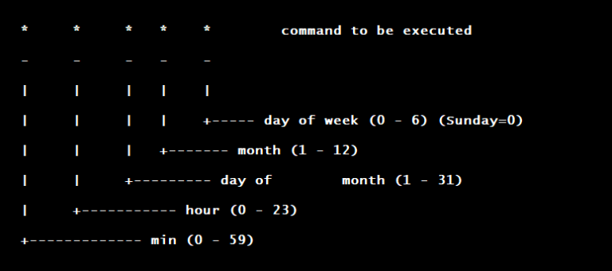

Description:
Scheduler in Unix

Cron Commands:
export EDITOR=vi ;to specify a editor to open crontab file.
crontab -e    Edit crontab file, or create one if it doesn’t already exist.
crontab -l    crontab list of cronjobs , display crontab file contents.
crontab -r    Remove your crontab file.
crontab -v    Display the last time you edited your crontab file. (This option is only available on a few systems.)

Format:

Cron Example:
A line in crontab file like below removes the tmp files from /home/someuser/tmp each day at 6:30 PM.
30     18     *     *     *         rm /home/someuser/tmp/*

Resources:
https://crontab.guru/
https://www.adminschoice.com/crontab-quick-reference
